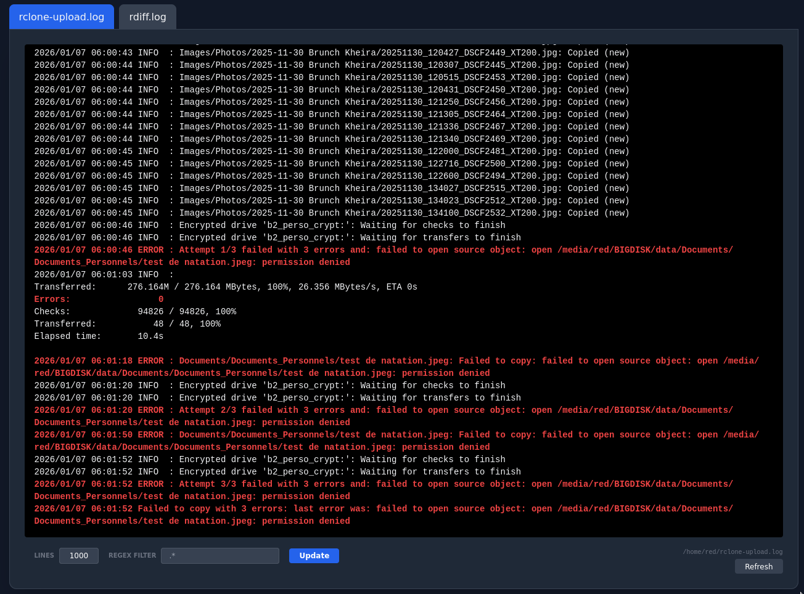

# Description

This tool simply display log files in a web interface.



# Usage

Add this to you `docker-compose.yml`:

```yaml
  simple-log-viewer:
    image: redvm/simple-log-viewer:latest
    container_name: simple_log_viewer
    hostname: simple_log_viewer
    ports:
        - 8081:8081
    volumes:
        - /my/dir/to/log:/logs:ro
    restart: unless-stopped
```
Of course, don't forget to change `/my/dir/to/log` to your own directory.


___
Optional env vars:


| Env var | Default | Description |
| :---         |     :---:      |          :---       |
| LOGS_DIR | /logs | Path to the directory containing log files. Can contains multiple directories separated by comma. |
| EXT | `*.log` | Glob pattern to filter files by extension. Can be multiple extensions separated by comma (e.g`*.log,*.txt,**/*.csv`). |
| N_LINES | 400 | Number of lines to tail from each file. |